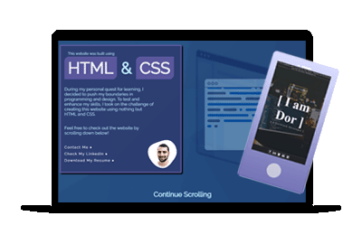

# HTML & CSS Website
During my personal quest for learning, I decided to push my boundaries in programming and design. To test and enhance my skills, I took on the challenge of creating this website using nothing but HTML and CSS.

I created this project using some of the knowledge I gained in:
- HTML
- CSS
- Git & Github
- Design Theory

Thank you for your time 😁

Live site: https://htmlcss-website.netlify.app/

